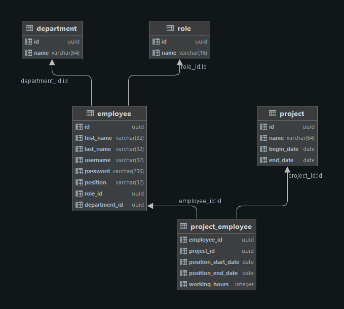

# Employee managment service
> Service for accounting of employees and their employment on projects. The service allows you to store information about employees, their departments and projects they are working on. The service provides basic CRUD operations for entities, API for retrieving available employees, API for exporting workload reports of employees and API for uploading employees from CSV file. The service secured by Basic Authorization.

# Installation
- **Download the project**
- **Build project by maven**
-  **Go to the directory:** ```employeestat/target```
- **Copy archive** ```employeestat.war``` **to the directory:** ```employeestat/src/main/docker/app```
-  **Go to the file:** ```employeestat/webapp/resources/properties/db.properties```
-  **Set the property value** ```jdbcUrl``` **to** ```jdbc:postgresql://db:5432/employee_db```
-  **Install the Docker Desktop** 
-  **Open the command prompt and go to the directory:** ```employeestat/src/main/docker```
-  **Enter the command:** ```docker-compose up```

# Endpoints

### API for exporting workload reports of employees
**GET** ```/api/employees/available``` - Get available employees at the current moment   
**GET** ```/api/employees/available/{days}``` -  Get available employees for the next amount of days

### API for uploading employees from CSV file
**GET** ```/api/employees/upload``` - Upload employees

# Swagger Documentation
**To open the swagger documentation go to URL:** ```http://localhost:8085/swagger-ui.htm```

# Database scheme


